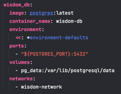
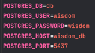
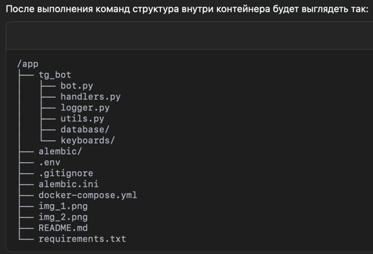
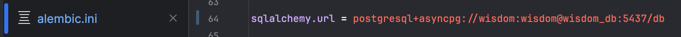
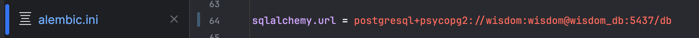
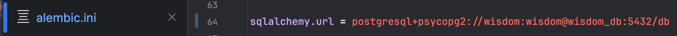
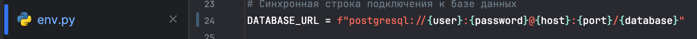
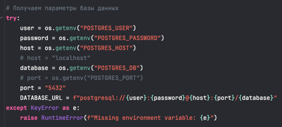

# wisdom_bot
ТГ-бот с мудростями каждый день

1. Создание ТГ-бота
   - Процесс создания
2. Создание docker-compose.yml с поднятием БД на PostgreSQL
   - Выбор образа, который будет подыматься в Docker
   
    
   - Логин/пароль/название БД/порт/хост(имя сервиса из docker-compose.yml)
   
    
   - Поднять контейнер - ❯ docker-compose up --build
   - Проверить созданную БД - ❯ psql -h localhost -U ${POSTGRES_USER} -d ${POSTGRES_DB} -p ${POSTGRES_PORT}
3. Создание Dockerfile для ТГ-бота
   - После создания
   
   
4. Создание модель в SQLAlchemy
   - Процесс создания
5. Создание таблиц через alembic
   - файл alembic.ini

   
   - Верный вариант
   
   
   - Верный вариант для работы в контейнере
   
   
  - файл env.py, внимательно, что подключение к БД должно быть синхронным
   
    
  - Вот так заработает запуск в контейнере и применение миграций, созданных локально

    
6. Запуск миграций
   - revision делается локально
   - upgrade уже прописан в команды при поднятии контейнера, внимательно с настройками
7. Порты внутри контейнеров должны общаться по-внутреннему 5432, обращения извне по 5437
8. Добавление Django